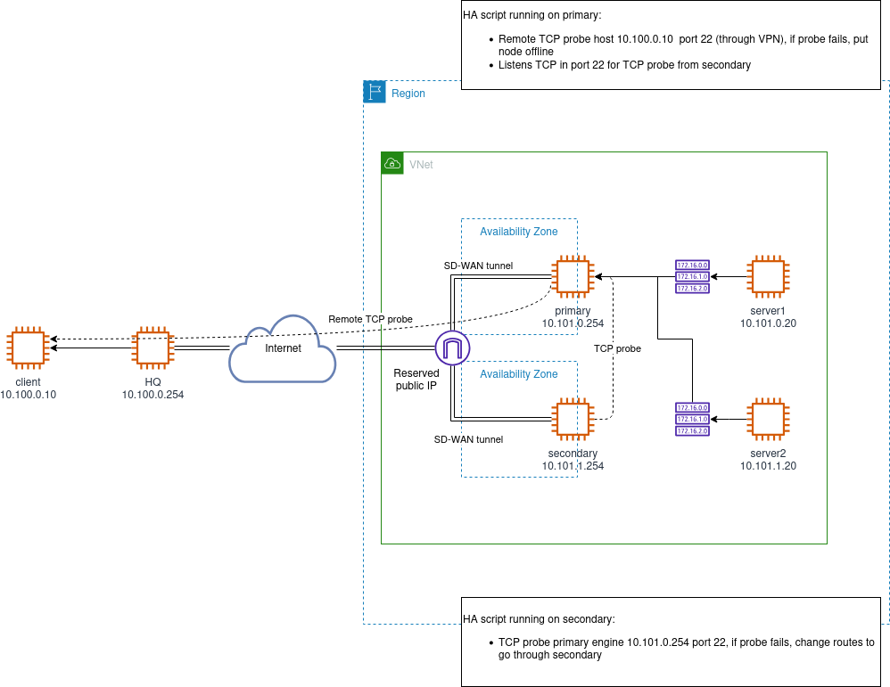

# Azure HA Script

High-availability failover extension script for **Forcepoint Secure SD-WAN**
(formerly Next Generation Firewall) engine pairs deployed in Microsoft Azure.
The script runs on a primary/secondary pair of SD-WAN Engines and automatically
reroutes traffic through the healthy engine when it detects a failure by
updating Azure route tables and, optionally, reassigning a public IP address.

## How It Works

- The **primary** engine monitors a remote host via TCP probing. If probing
  fails, it marks itself offline via an Azure VM tag.
- The **secondary** engine monitors the primary via TCP probing. If the primary
  is unreachable or marked offline, the secondary takes over by updating Azure
  route tables (and optionally moving the public IP).

## Key Features

- Automatic failover via Azure route table updates
- Optional public IP reassignment to the active engine
- Compatibility with policy and route based VPN
- TCP health probing (primary-to-remote and secondary-to-primary)
- Azure Managed Identity authentication
- Configurable via SMC Custom Properties, Azure VM tags, or both
- Debug and dry-run modes for safe testing

## Prerequisites

- Two Forcepoint Secure SD-WAN Engines deployed in Azure
- An Azure Managed Identity assigned to each VM with the required permissions
- One or more Azure route tables directing internal traffic through the
  firewall pair

See the [User Guide](./doc/user_guide.md) for full setup and permission details.

## Configuration

The script reads configuration from two sources that are merged at runtime:

1. **SMC Custom Properties** - set in the Engine properties within the SMC
2. **Azure VM tags** - prefixed with `FP_HA_` (e.g. `FP_HA_route_table_id`)

When the same key appears in both sources, Azure VM tags take precedence.
Refer to the [User Guide](./doc/user_guide.md) for the full list of mandatory
and optional properties.

## Development

Building from source is only recommended if you want to modify the behaviour.
Use prebuilt GitHub releases otherwise.

- **Python 3.11** (via pyenv or similar)
- Build the self-expanding zipapp installer: `make all`

See [doc/development.md](./doc/development.md) for details.

## License

Licensed under the Apache License 2.0 - see [LICENSE](./LICENSE).
